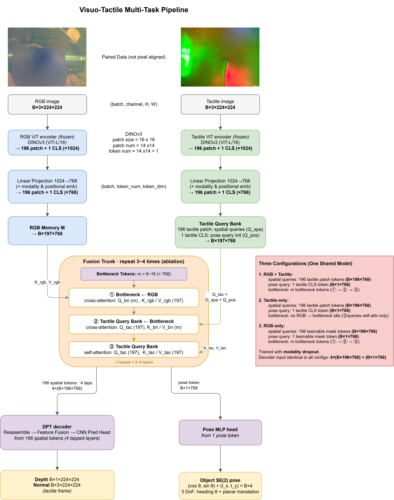

# VisTacFusion

A visuo-tactile **multi-task** model. From a **paired (not pixel-aligned)** RGB image and a
vision-based tactile image, it predicts — in the **tactile frame** —

- **Dense 3D**: per-pixel **depth** + **surface normal** (DPT head)
- **Pose**: object **SE(2)** pose, i.e. heading θ and planar translation (Pose MLP head)

The model is trained on **simulation** and deployed on **real** sensors (sim-to-real). The
central hypothesis is that **RGB + tactile beats either modality alone**, tested with a *fair*
ablation: **one shared model**, identical trainable parameters, and an **identical decoder
input** across all three input configurations.

## Architecture



Both ViT encoders are **frozen DINOv3** feature extractors — this is the sim-to-real anchor and
half of the fairness argument. Everything else (projections, embeddings, bottleneck, fusion
trunk, heads) is trainable.

RGB and tactile are **never pixel-aligned**; their correspondence is learned purely through
cross-attention. **Tactile is the spatial anchor** (it initializes the 196 spatial queries and
the pose query), while **RGB is read-only context** that only ever serves as cross-attention
keys/values — it flows into the model through a handful of **bottleneck tokens**, never as
queries.

The fusion trunk repeats an asymmetric 3-step layer `L` times:

| step | operation | attention |
|------|-----------|-----------|
| ① | bottleneck ← RGB memory | cross-attn |
| ② | queries ← bottleneck | cross-attn |
| ③ | queries ← queries | self-attn |

Because an attention block's output length follows the **query** count (independent of K/V),
the decoder always receives the same thing — `4 × (B×196×768)` spatial taps + `B×1×768` pose
token — **regardless of which modalities are present**.

### Three configurations, one shared model

Trained jointly with **modality dropout** (each step samples a config). The three configs are
inference-time input modes, not separate models:

| Config | spatial queries (196) | pose query (1) | cross-modal path |
|--------|----------------------|----------------|------------------|
| **RGB + tactile** | tactile patch tokens | tactile CLS | ①②③ run |
| **tactile-only** | tactile patch tokens | tactile CLS | no RGB → only ③ |
| **RGB-only** | learnable mask tokens | learnable mask token | ①②③ run |

## Repository layout

```
configs/                 model.yaml · train.yaml · data.yaml
vistacfusion/
  models/                encoders.py · projection.py · fusion.py · model.py
    heads/               dpt.py · pose.py
  data/                  dataset.py · transforms.py
  losses/                depth.py · normal.py · pose.py · total.py
  engine/                train.py · eval.py · metrics.py
  utils/                 config.py · misc.py
tests/                   test_shapes.py · test_overfit.py
scripts/                 train.sh · eval.sh · ablation.sh
```

## Getting started

```bash
pip install -e .          # installs the `vistacfusion` package and dependencies
pytest                    # shape invariants + one-batch overfit
```

You can run the **entire pipeline without DINOv3 weights**. With `dataset: synthetic`
(default in `configs/data.yaml`) and `encoder.checkpoint: null` (default in
`configs/model.yaml`), a `MockEncoder` of identical output shape stands in for DINOv3, so the
model, losses, training loop, and evaluation all run on CPU:

```bash
python -m vistacfusion.engine.train --epochs 1
```

Evaluation reports metrics **per modality config** (both / tactile / rgb) — that table is the
fairness ablation the project is built around.

## Using real DINOv3 weights and real data

1. **Weights.** DINOv3 is gated. Download and convert
   `facebook/dinov3-vitl16-pretrain-lvd1689m` to a local `.pth`, then set
   `encoder.checkpoint` in `configs/model.yaml`. The real encoder loads the architecture via
   `torch.hub` (`pretrained=False`) and applies the local weights.
2. **Data.** Set `dataset: sim` and fill in `configs/data.yaml` (`sim.root`, `sim.rgb_subdir`),
   then implement the two dataset-specific hooks in `vistacfusion/data/dataset.py`, both marked
   `[TODO/USER]`:
   - the **paired-RGB** path convention, and
   - the **SE(2) pose GT** loader (`SimVisuoTactileDataset._load_pose`).

   The tactile/depth/normal loading and `TactileAugment` are already in place.

## DPT tap source: v1 vs v2

Set `heads.dpt.tap_source`:

- **`trunk` (v1, default)** — the 4 DPT taps are the spatial queries read from 4 fusion-trunk
  layers. Simplest and fully fair; start here.
- **`encoder_multiscale` (v2)** — the 4 taps come from 4 tactile-encoder layers, with a per-tap
  **residual RGB injection** through the condensed bottleneck. A ReZero gate (init 0) means v2
  starts as pure encoder taps and learns to inject; when RGB is absent the injection adds
  exactly 0, so single-modality inference stays fair.

Both are built in and switchable by config, but they are **not checkpoint-compatible**
(v2 has extra parameters) — switching requires retraining.

## Ablation knobs

Wired as config flags: bottleneck width `m ∈ {8,16,32}`, trunk depth `L ∈ {2,3,4}`,
`bottleneck_continuity ∈ {reset,carry}`, `fusion_variant ∈ {asymmetric,symmetric_coattention}`,
`pose_mode ∈ {regression,classification}`, `share_encoder_weights`, and
`tap_source ∈ {trunk,encoder_multiscale}`. See `scripts/ablation.sh`.

## Status

The architecture is complete and verified on CPU with the mock encoder: the decoder input is
identical across all three configs (v1 and v2), the v2 injection is provably zero without RGB,
the encoders are frozen, and a single batch overfits across depth + normal + pose. Remaining
work is wiring real inputs: the DINOv3 checkpoint, the sim/real data loaders, the paired-RGB
convention, and the SE(2) pose ground truth.
